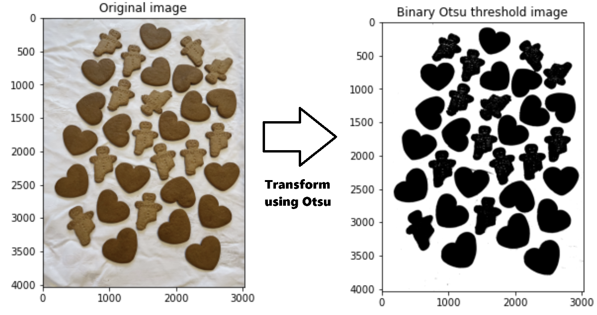

## Otsu Thresholding Implementation

This project demonstrates an implementation of **Otsu’s thresholding algorithm** from scratch in Python.  

### What it does
- Loads the input image (`gingerbreads.jpg`)
- Computes its histogram (256 bins)
- Applies **Otsu’s method** to calculate the optimal threshold value  
- Binarizes the image into black and white (foreground vs background)  
- Displays the original image, histogram, thresholded binary image, and its histogram

### Example Output
- **Optimal Otsu Threshold Value:** `138`  
- **Visualizations:**  
  - Original image  
  - Histogram of original image  
  - Binary image after thresholding  
  - Histogram of binary image  

### Key Functions
- `get_image(name)` → loads an image using *scikit-image*  
- `show_image(image, label)` → displays images with matplotlib  
- `histogram(image)` → computes grayscale histogram  
- `otsu(image)` → calculates optimal threshold using Otsu’s method  
- `threshold(image, th)` → binarizes the image using a given threshold (or Otsu’s if `None`)  

---

📄 *This is part of the Assignments folder for the INF250 Image Processing course.*
