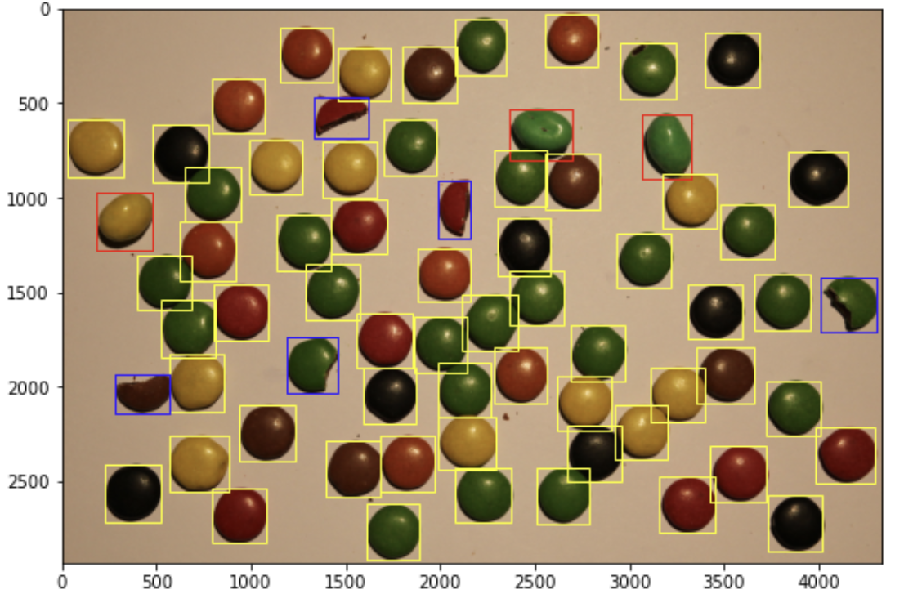

## Shapes of Objects – Distinguishing Non Stops from M&Ms 🍫

### Task  
Using **image analysis**, this project processes the image `IMG_2754_nonstop_alltogether.JPG` to automatically distinguish between **M&Ms and Non Stops (whole and broken)** based on their shapes and geometric properties.  

### Approach  
1. **Preprocessing & Cropping** – Load the RGB and grayscale versions of the image, crop to the relevant region.  
2. **Thresholding** – Apply global thresholding (Triangle method) to create a binary mask.  
3. **Noise Removal** – Fill small holes and remove tiny objects for cleaner segmentation.  
4. **Watershed Segmentation** – Use distance transform and watershed to separate overlapping candies.  
5. **Feature Extraction** – Measure object properties (eccentricity, area, axis length).  
6. **Classification** – Identify objects as:
   - **M&Ms** – large, round objects (eccentricity ≥ 0.30, area ≥ 60,000, axis length ≥ 330).  
   - **Whole Non Stops** – (criteria defined by region properties).  
   - **Broken Non Stops** – smaller elongated objects (eccentricity ≥ 0.5, axis length ≥ 280, area < 60,000).  
7. **Visualization** – Highlight detected objects with bounding boxes:  
   - Red = M&Ms  
   - Yellow = Whole Non Stops  
   - Blue = Broken Non Stops  

### Example Output  
- Cropped input image (RGB & grayscale)  
- Binary mask after thresholding  
- Distance map & watershed segmentation  
- Final annotated image with detected candies highlighted  

---

📄 *This was part of the **INF250 Image Processing** course assignment (Deadline: Nov 4, 2022).*  
